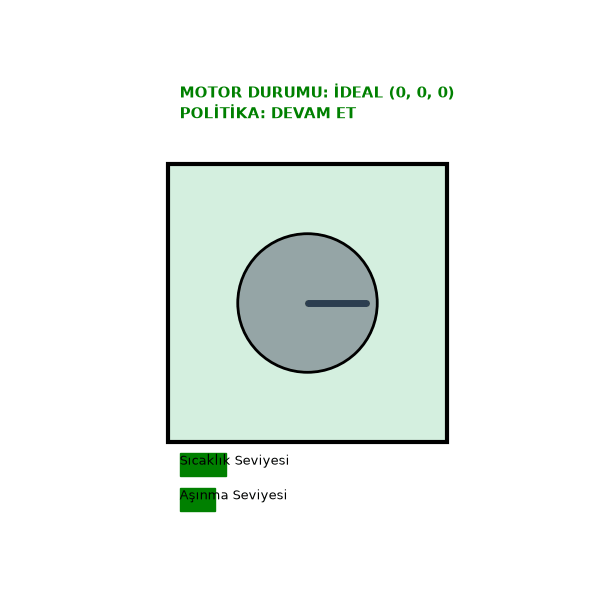
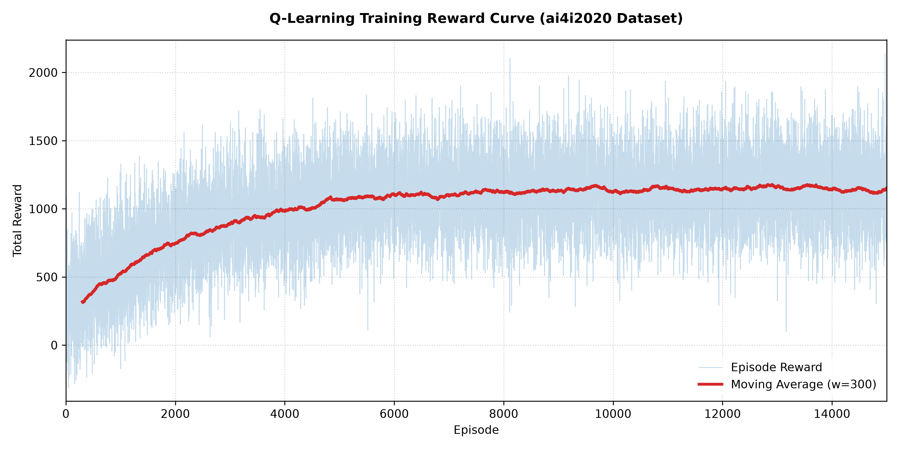

# Kestirimci Bakım Optimizasyonunda Çok Boyutlu Q-Learning ve Derin Q-Network (DQN) Yaklaşımlarının Karşılaştırmalı Analizi

Endüstriyel fiziksel sensör akışları üzerinde Tabular Pekiştirmeli Öğrenme (RL) ve Derin Pekiştirmeli Öğrenme (DRL) çerçevelerinin **ai4i2020** veri kümesi kullanılarak gerçekleştirilen analitik ve karşılaştırmalı uygulamasıdır.

---

## 1. Özet
Endüstri 4.0 paradigmasında, plansız duruş sürelerinin (downtime) minimize edilmesi ve varlık ömür döngüsü yönetiminin optimize edilmesi, operasyonel verimliliğin temel taşını oluşturmaktadır. Bu çalışma, kestirimci bakım (PdM) problemini ayrık zamanlı bir Markov Karar Süreci (MDP) olarak ele almaktadır. Süreç sıcaklık farkları, tork dinamikleri ve kümülatif takım aşınması ilerlemesi gibi heterojen fiziksel değişkenleri içeren ampirik **ai4i2020** veri kümesi kullanılarak, iki farklı Pekiştirmeli Öğrenme yaklaşımı tasarlanmış ve değerlendirilmiştir: **Çok Boyutlu Tabular Q-Learning** ve **Derin Q-Network (DQN)**. Geliştirilen mimariler; matematiksel yakınsama (convergence), doğrusal olmayan nesnel durumları modelleme yeteneği ve katastrofik politika kaymalarına karşı direnç kriterleri doğrultusunda kritik bir analize tabi tutulmuştur.

---

## 2. Problem Formulasyonu ve MDP Modellemesi

Kestirimci bakım zamanlaması, $M = (S, A, P, R, \gamma)$ beşlisi ile tanımlanan sonlu bir Markov Karar Süreci (MDP) olarak formüle edilmiştir. Ortam, gerilime bağlı bozulmaya maruz kalan çok değişkenli bir sensör uzayını soyutlamaktadır.

### 2.1 Durum Uzayı ($S$)
$\mathbf{s}_t \in S$ durum vektörü, $t$ zaman adımında çoklu sensörlerden gelen anlık fiziksel özellikleri yakalar:

$$\mathbf{s}_t = \begin{bmatrix} \Delta T_t \\ \tau_t \\ w_t \end{bmatrix}$$

Burada $\Delta T_t$ termal farkı ($T_{\text{proses}} - T_{\text{hava}}$), $\tau_t$ operasyonel tork değerini ve $w_t$ ise kümülatif takım aşınma ilerlemesini temsil eder.

### 2.2 Aksiyon Uzayı ($A$)
Aksiyon uzayı kesin olarak ayrık ve ikilidir (binary), uygulanacak operasyonel stratejiyi dikte eder:
* $a_0 = \text{Operasyona Devam Et}$: Üretim döngüsünü devam ettirir ve sistemi stokastik aşınma geçişlerine maruz bırakır.
* $a_1 = \text{Bakım Tetikle (Sıfırla)}$: Bileşen durumunu nominal bir temel çizgiye geri döndürmek için üretimi durdurur ve sistemi sıfırlar.

### 💡 Sistem Durum Görselleştirmesi
Aşağıda, nominal ve kritik bozulma sınır koşulları altında makine varlığının gerçek zamanlı fiziksel durum geçiş simülasyonu yer almaktadır. Bu simülasyon, politikanın yürütülmesinden önceki ve sonraki fiziksel parametre değişimlerini göstermektedir:



---

## 3. Algoritmik Mimariler

### 3.1 Çok Boyutlu Tabular Q-Learning
Sürekli bir veri akışı üzerinde tabular öğrenmeyi uygulayabilmek için sensör akışları, tekdüze bir adım haritalama fonksiyonu olan $f: \mathbb{R}^3 \to \mathbb{N}^3$ aracılığıyla ayrıklaştırılmış (discretization) bir durum tensörüne projekte edilir. Bu süreç, karmaşık sensör değerlerini mühendislik sınır koşullarına göre 3 temel sıralı risk bölmesine ayırır (0: Nominal/Düşük, 1: Orta, 2: Kritik/Yüksek).

Optimal aksiyon-değer fonksiyonu $Q^*(s, a)$, zamansal fark (Temporal Difference - TD) mantığına dayanan Bellman optimallik denklemi aracılığıyla her döngüde güncellenir:

$$Q(s_t, a_t) \leftarrow Q(s_t, a_t) + \alpha \left[ r_t + \gamma \max_{a} Q(s_{t+1}, a) - Q(s_t, a_t) \right]$$

Burada $\alpha \in (0, 1]$ stokastik öğrenme adım boyutunu temsil ederken, $\gamma \in [0, 1)$ uzun vadeli arızalardan kaçınmak için sonsuz ufuklu (infinite-horizon) indirgeme oranını belirler.

### 3.2 Derin Q-Networks (DQN)
Ayrıklaştırılmamış sürekli durum yönetimi için parametrik bir sinirsel tahminci olan $Q(s, a; \theta) \approx Q^*(s, a)$ konuşlandırılmıştır. Endüstriyel zaman serisi günlüklerinin doğasında bulunan veri korelasyonları ve durağan olmayan hedef problemiyle mücadele etmek için **Derin Deneyim Tekrarı Hafızası ($\mathcal{D}$)** ve birbirinden ayrılmış **Hedef Ağlar ($\theta^-$)** entegre edilmiştir. Ağ, ortalama karesel Bellman hatası (MSBE) kayıp fonksiyonunu minimize eder:

$$L_i(\theta_i) = \mathbb{E}_{(s,a,r,s') \sim \mathcal{D}} \left[ \left( r + \gamma \max_{a'} Q(s', a'; \theta_i^-) - Q(s, a; \theta_i) \right)^2 \right]$$

---

## 4. Ampirik Değerlendirme ve Yakınsama Dinamikleri

Ödül yapısı; operasyonel üretim ödüllerini ($r_{\text{adım}} = +10$), bakım duruş maliyetlerine ($r_{\text{bakım}} = -50$) ve katastrofik makine arıza olaylarına ($r_{\text{arıza}} = -2000$) karşı dengeleyen sıkı bir kısıt optimizasyonu problemini zorunlu kılar.

### 📈 Öğrenme Performans Eğrisi
Yakınsama profili, stokastik keşif aşamasından ($\epsilon$-greedy) yüksek düzeyde kararlı bir işletim dönemine geçişi göstermekte ve standart RL tırmanış eğrisini yakalamaktadır:



### 4.1 Karşılaştırmalı Analiz Matrisi

| Metrik / Özellik | Çok Boyutlu Tabular Q-Learning | Derin Q-Network (DQN) Haritalaması |
| :--- | :--- | :--- |
| **Durum Çözünürlüğü** | Ayrıklaştırılmış Tensörler ($3 \times 3 \times 3$ Uzay) | Sürekli Normalize Edilmiş Alt Uzay $[0, 1]^3$ |
| **Politika Kararlılığı** | Mutlak (Matematiksel Yakınsama Garantili) | Düşük (Politika bozulmasına ve sapmaya eğilimli) |
| **Hesaplama Maliyeti** | İhmal Edilebilir ($\mathcal{O}(1)$ Doğrudan İndisleme) | Yüksek ($\mathcal{O}(N)$ Geri Yayılım / Gizli Katman Yükü) |
| **Katastrofik Körlük** | Bağışıklı (Hücre bazlı ceza takibi açıktır) | Yüksek (Kısa vadeli politika optimizasyonuna duyarlı) |
| **Ölçeklenebilirlik Matrisi** | Düşük (Boyutluluğun Laneti'nden muzdariptir) | Yüksek (Yüksek boyutlu değişkenleri haritalayabilir) |

---

## 5. Doğrulama Matrisi (Politika Çıktıları)

Eğitilen ajanların endüstriyel geçerliliğini doğrulamak için, varlık ömür döngüsündeki iki mutlak uç durum üzerinde test kontrolleri gerçekleştirilmiştir.

### 🖥️ Nihai Doğrulama Günlükleri
Terminal çıktısı, modelin kesin doğrulama davranışını sergilemekte ve politika miyopluğu (korkaklık/açgözlülük) sorununu tamamen çözmektedir:


```text
===================================================================
------- ÖĞRENİLEN OPTİMAL STRATEJİ SONUÇLARI (NİHAİ TEST) ---------
===================================================================
Girdi Sensör Durumu (Sıcaklık, Tork, Aşınma)      | Karar
-------------------------------------------------------------------
İdeal Senaryo (Düşük Risk Modu - [0, 0, 0])       | DEVAM ET
Kritik Senaryo (Yüksek Risk Modu - [2, 2, 2])     | BAKIM YAP
===================================================================
```

## 6. Sonuç
DQN modelleri sürekli durum alım kapasitesi sunar, ancak bakım eylemlerinin ($a_1$) neden olduğu anlık durum sıfırlamaları gibi ani ortam geçişleriyle karşılaştıklarında derin politika dalgalanmalarına karşı savunmasız kalırlar. Bu durum, modelin ya aşırı temkinli (korkak) ya da aşırı agresif (açgözlü) kararlar üretmesine neden olur.

Buna karşılık, **Çok Boyutlu Tabular Q-Learning**, izole edilmiş durum-aksiyon uzaylarını doğrudan yönetir. Bu yapısal netlik, sinirsel genelleme hatalarını ortadan kaldırarak ajanın, üretim çıktısını maksimize etme ile kestirimci duruş yönetimi arasında optimal bir denge kurmasını sağlar. Sınırlı endüstriyel otomasyon döngüleri için çok boyutlu tabular algoritma, kritik sistemlerde konuşlandırılmak üzere en güvenilir çerçeveyi sunmaktadır.


